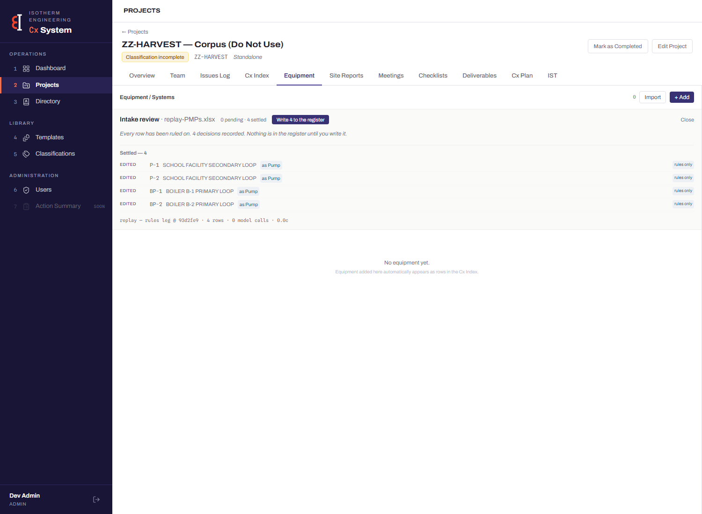

# Phase 2 gate — the evidence walk

*[KEEL] 2026-08-14. A followable trace of the loop closing: machine errs →
human corrects → signal captures → librarian rediscovers. Each step is
verifiable live in about five minutes; step 5 is the checklist.*

**Why this document can show values other artifacts may not:** the corpus is
ZZ-HARVEST replay data — schedules re-read by a deliberately checked-out
historical parser onto a dedicated non-client project — not live client intake.
Showing its values here was ruled acceptable for this walk (owner ruling,
2026-08-14); every other committed artifact stays shape-only, values behind
UUIDs.

---

## 1 · The erring machine

**Commit `93d2fe9`** — the parser's state immediately before `e19d1a3`, the
Avondale Part 1 fixes (service→area_served, served-value-never-types, title
recovery past a sparse group header). Built from git by `harvest-replay.mjs`;
never hand-modified.

**The measured proof it erred** — its actual output on the corpus files,
captured before staging (quoted, not described):

```
── AS.xlsx · Sheet1 — 1 rows
   {"tag":"AS-1","descriptor":"HEATING SYSTEM","location":"BOILER ROOM","area_served":null,"proposed_type":"air_separator",...}
── Boilers.xlsx · Sheet1 — 2 rows
   {"tag":"B-1","descriptor":"HYDRONIC HEATING","location":"BOILER ROOM","area_served":null,"proposed_type":"boiler",...}
   {"tag":"B-2","descriptor":"HYDRONIC HEATING","location":"BOILER ROOM","area_served":null,"proposed_type":"boiler",...}
── PMPs.xlsx · Sheet1 — 4 rows
   {"tag":"BP-1","descriptor":"BOILER B-1 PRIMARY LOOP","location":"BOILER ROOM","area_served":null,"proposed_type":"boiler",...}
   {"tag":"BP-2","descriptor":"BOILER B-2 PRIMARY LOOP","location":"BOILER ROOM","area_served":null,"proposed_type":"boiler",...}
   {"tag":"P-1","descriptor":"SCHOOL FACILITY SECONDARY LOOP","location":"BOILER ROOM","area_served":null,"proposed_type":null,...}
   {"tag":"P-2","descriptor":"SCHOOL FACILITY SECONDARY LOOP","location":"BOILER ROOM","area_served":null,"proposed_type":null,...}
```

Three defects, visible in the raw output: every SERVICE value sits in
`descriptor` with `area_served` null (all 7 rows); BP-1/BP-2 are typed
**boiler** from what they serve; P-1/P-2 are untyped because the title tier
missed the sparse group header. For contrast, today's parser reads the same
files correctly on all three axes — which is why the corpus had to replay the
machine that erred (§7d of the harvest proposal).

## 2 · The corrections, row by row

Dispositioned through the **live review surface**, sighted, on
ZZ-HARVEST — Corpus (Do Not Use). ★ marks the four PMPs-sheet rows that
correspond to the originally ruled hand-count of 4.

| Tag | Erring machine proposed | Human chose | Signal |
|---|---|---|---|
| AS-1 | `air_separator` · SERVICE value in `descriptor` | value → `area_served` | `65e65395-8696-4944-9c70-ecd41cca2136` |
| B-1 | `boiler` · SERVICE value in `descriptor` | value → `area_served` | `b8ce5f80-5986-4456-b882-5dceb0326925` |
| B-2 | `boiler` · SERVICE value in `descriptor` | value → `area_served` | `9e49174d-e93d-46ec-82bb-4d4e04411eda` |
| ★ BP-1 | **`boiler`** · SERVICE value in `descriptor` | value → `area_served` · **type → `pump`** | `8953bbe0-a0b6-4c3a-b00a-147f659a6300` |
| ★ BP-2 | **`boiler`** · SERVICE value in `descriptor` | value → `area_served` · **type → `pump`** | `d9eec373-3330-4819-a5e4-656dac602c59` |
| ★ P-1 | *untyped* · SERVICE value in `descriptor` | value → `area_served` · **type → `pump`** | `4b7d9b4c-bf3d-4904-bcbc-6278a3fab83f` |
| ★ P-2 | *untyped* · SERVICE value in `descriptor` | value → `area_served` · **type → `pump`** | `900a4eda-facf-4e03-93f9-e1c63b3b877b` |

The review surface after the PMPs dispositions — four rows EDITED, each naming
the reading it was taken as, `rules only` provenance chips, the archaeology in
the parse note, and the register still empty (dispositioned-not-approved):



## 3 · One signal in the database, whole

The BP-1 specimen (`correction_signals` row
`8953bbe0-a0b6-4c3a-b00a-147f659a6300`):

```
disposition:    edited                  read_via:  rules
proposed_type:  boiler                  ← the machine's proposal, frozen
edited: {
  "area_served":   "BOILER B-1 PRIMARY LOOP",   ← the human's outcome
  "proposed_type": "pump",
  "descriptor":    null, ...
}
```

The join through `row_id` (`4b033f94-7d84-4f7a-bdf5-ecdc8881c732` →
`intake_rows.claims`) shows the machine's side of the same fields:

```
claims.descriptor.rules  = "BOILER B-1 PRIMARY LOOP"   ← where the machine PUT it
claims.area_served.rules = null                         ← where it DIDN'T
reasoning = "replay@93d2fe9 · header: TAG | MANUFACTURER | MODEL | QTY |
             LOCATION | SERVICE | TYPE | FLOW [GPM] | ..."
```

**The move signature, explicit:** `machine[descriptor] = human[area_served]` —
the same string, machine-placed in one field, human-recorded in the other. The
other six signals carry the same shape; they are the table in step 2.

## 4 · The librarian's derivation

From `2026-08-14-first-pass.md` (generated by `harvest-librarian.mjs`,
read-only):

> **SERVICE → area_served** — 7 occurrences, 0 contradictions · column
> attribution: SERVICE: 7/7 · ALREADY HELD by the deterministic layer
> (measured: today's parser lands a SERVICE column in area_served) —
> REDISCOVERY, not proposed

**The statement that matters:** the librarian was never told this rule. Its
only inputs were the seven signal rows above — it found the moved values,
opened the corpus sheets to locate each value's column index, took the label
from the header recorded at staging time, and arrived at SERVICE → area_served
on its own. The held-check then ran **today's** parser on a synthetic
SERVICE-column sheet, observed the value land in `area_served`, and filed the
rule as a REDISCOVERY rather than a proposal — the corpus independently
re-deriving a lesson the firm learned by hand in June, which is precisely what
the gate exists to measure: **the capture records enough.**

(The occurrence count is 7 against the ruled 4: the replay surfaced the same
defect on all three sheets, not only the pump sheet the original hand-count
came from. The ruled four are the ★ rows; their signal pointers are in the
artifact's evidence list.)

## 5 · See it live — five steps, about five minutes

1. **The corpus:** app → Projects → **ZZ-HARVEST — Corpus (Do Not Use)**. Its
   register says "No equipment yet" — dispositioned-not-approved, as ruled.
2. **The dispositioned review:** Equipment tab → **Import** → open
   `replay-PMPs.xlsx` → the Settled block shows the four ★ rows, each
   "EDITED … as Pump", each with its `rules only` chip; the parse note reads
   `replay — rules leg @ 93d2fe9 · 4 rows · 0 model calls · 0.0c`.
3. **One signal:** in Supabase (or any SQL client):
   `select * from correction_signals where id = '8953bbe0-a0b6-4c3a-b00a-147f659a6300';`
   — the step-3 specimen, live.
4. **The artifact:** `docs/harvest-artifacts/2026-08-14-first-pass.md` in the
   repo (shape-only; the values you just saw live stay behind the UUIDs there).
5. **Watch the derivation happen:** from the repo root,
   `node --env-file=.env harvest-librarian.mjs`
   — read-only; it regenerates the artifact from the database in front of you,
   and prints the rediscovery line as it lands.

---

*Cost of the entire corpus: 0.0c over 0 model calls. Erring machine `93d2fe9`,
carried in every upload's parse_note and every artifact entry.*
